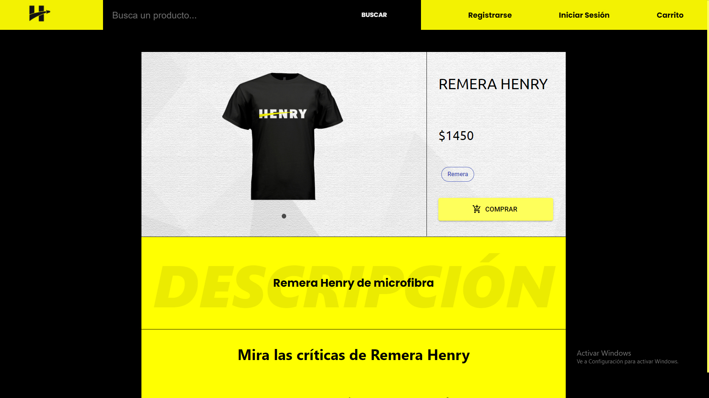
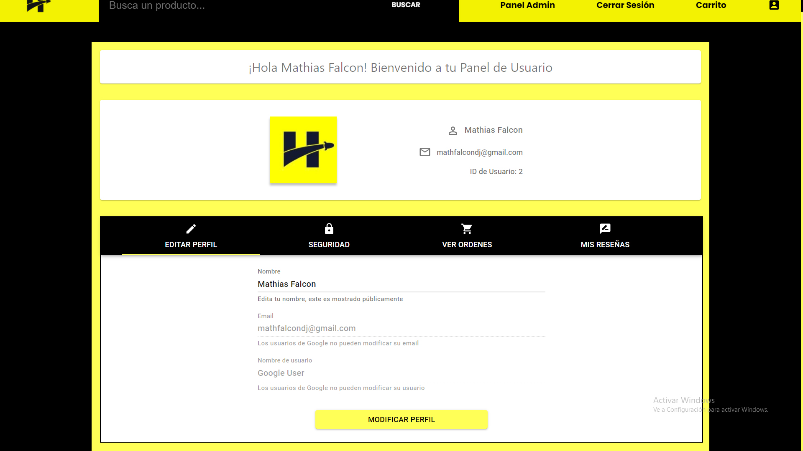

<p align='left'>
    
</p>

# Henry E-Commerce Project


## HENRY STORE

This is a project made by a team of 5 people *(check contributors)* as part of our education at [Soy Henry](https://www.soyhenry.com/). The point of this activity consisted on creating an online store of any merchandise we choose.

The project itself it's written in Spanish because not all of us know how to speak English.

### Tech Stack

- **Front End:**
    + HTML - CSS - Javascript
    + React Dom, React Hooks, React Redux, React Router Dom
    + Redux
    + Material UI for React
    + Axios

- **Back End:**
    + Node.js
    + Express
    + Passport Session Authentification (Local Strategy and Google Strategy)
    + PostgreQL
    + Sequelize
    + Sendgrid

# How to start the project:

To run this project locally follow the next steps:

- Clone (or fork and clone) this repository
- Install [PostgreSQL](https://www.postgresql.org/) 
- Run command prompt and enter `psql -U postgres` and enter the password you provided when installing PostgreSQL.
- Enter `CREATE DATABASE development;` 
- Run ```npm i``` inside ```/api``` and ```/client/```
- Head to the [Google](https://console.developers.google.com/projectselector2/apis/dashboard?supportedpurview=project) developer console to set up your OAuth keys. If you're unfamiliar with this process, you can find some helpful guides [here](https://developers.google.com/fit/android/get-api-key), [here](https://theonetechnologies.com/blog/post/how-to-get-facebook-application-id-and-secret-key) or in this [video](https://www.youtube.com/watch?v=o9e3ex-axzA).

- Sign up with [Sendgrid](https://sendgrid.com/) and obtain an API key.

- Create a `.env` file inside  `api` folder with the format provided in the `.env.example` file

The app doesn't have any products or users created by default, you'll have to add them yourself! In order to do so, you'll have to log in as an admin. Use Postman or other similar tool to make a PUT request to
``http://localhost:3100/users/promote/:userId``

Keep in mind that you must create a user before making the PUT request.

# Previews

### Home page:


### Product Catalogue:


### Product Page:


### Login:


### User Profile:


### Admin Control Panel:


# About Us:

We are 5 developers from Argentina and Uruguay.

Our Github accounts:

- [Mathías Falcón (UY)](https://github.com/mathfalcon)
- [Matias Bonino (AR)](https://github.com/matias2301)
- [Agustín Dominguez (AR)](https://github.com/GusdomDominguez)
- [Santiago Sosa (AR)](https://github.com/Santi-Sosa)
- [Lucas Casco (AR)](https://github.com/lucascasco1)